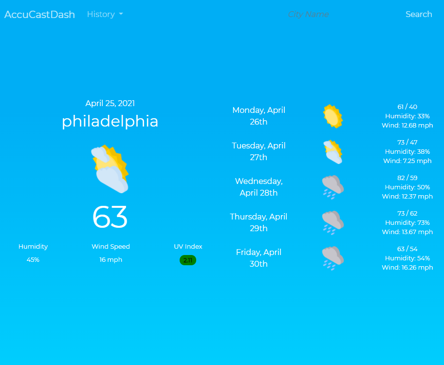
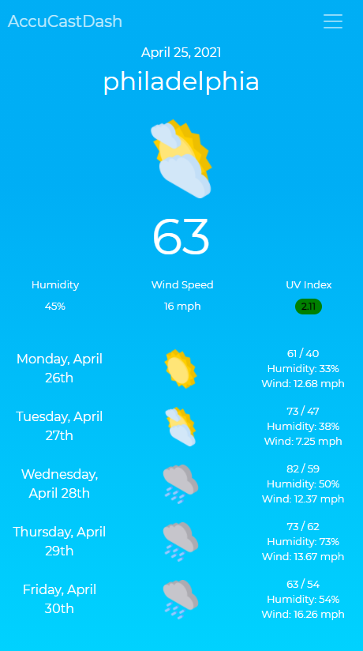

# AccuCastDash

AccuCastDash is a weather dashboard that displays the current weather conditions as well as a 5-day forecast. The user can search for specific locations by city name which is converted to coordinates and then used to pull data from the OpenWeatherMap API. A search history is saved to localStorage to help the user keep track of their searches. Dates are parsed and formatted by moment.js. Icons were sourced from https://www.flaticon.com/packs/meteorology

Deployed repo: https://jlamonade.github.io/AccuCastDash/

